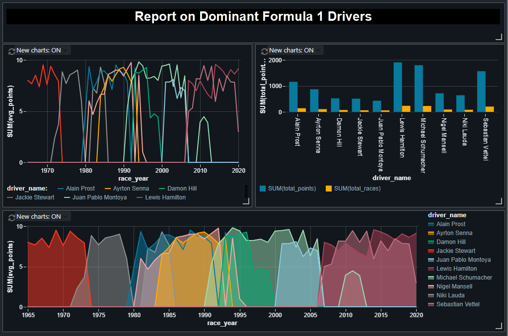
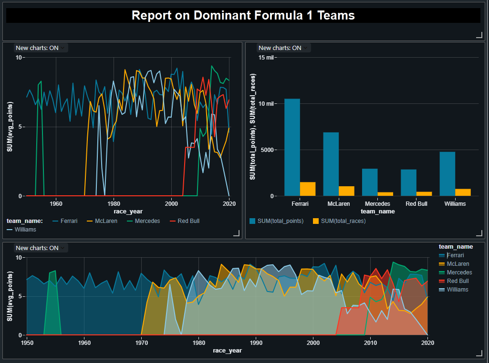

# Formula 1: Hands-on Project

Real World Project on Formula1 Racing using Azure Databricks, Delta Lake, Unity Catalog, Azure Data Factory

Course: Azure Databricks & Spark For Data Engineers: Hands-on Project
20H

Sources of Information:
- http://ergast.com/mrd/db/ 
- https://www.bbc.com/sport/formula1

## Visualizations of a quick data analysis

&emsp;

## Detailed information on the course:
### Azure Databricks
Building a solution architecture for a data engineering solution using Azure Databricks, Azure Data Lake Gen2, Azure Data Factory and Power BI\
Creating and using Azure Databricks service and the architecture of Databricks within Azure\
Working with Databricks notebooks as well as using Databricks utilities, magic commands etc\
Passing parameters between notebooks as well as creating notebook workflows\
Creating, configuring and monitoring Databricks clusters, cluster pools and jobs\
Mounting Azure Storage in Databricks using secrets stored in Azure Key Vault\
Working with Databricks Tables, Databricks File System (DBFS) etc\
Using Delta Lake to implement a solution using Lakehouse architecture\
Creating dashboards to visualise the outputs\

### Spark (Only PySpark and SQL)
Spark architecture, Data Sources API and Dataframe API\
PySpark - Ingestion of CSV, simple and complex JSON files into the data lake as parquet files/ tables\
PySpark - Transformations such as Filter, Join, Simple Aggregations, GroupBy, Window functions etc\
PySpark - Creating local and temporary views\
Spark SQL - Creating databases, tables and views\
Spark SQL - Transformations such as Filter, Join, Simple Aggregations, GroupBy, Window functions etc\
Spark SQL - Creating local and temporary views\
Implementing full refresh and incremental load patterns using partitions

### Delta Lake
Emergence of Data Lakehouse architecture and the role of delta lake.
Read, Write, Update, Delete and Merge to delta lake using both PySpark as well as SQL \
History, Time Travel and Vacuum\
Converting Parquet files to Delta files\
Implementing incremental load pattern using delta lake\

### Unity Catalog
Overview of Data Governance and Unity Catalog\
Create Unity Catalog Metastore and enable a Databricks workspace with Unity Catalog\
Overview of 3 level namespace and creating Unity Catalog objects\
Configuring and accessing external data lakes via Unity Catalog\
Development of mini project using unity catalog and seeing the key data governance capabilities offered by Unity Catalog such as Data Discovery, Data Audit, Data Lineage and Data Access Control\

### Azure Data Factory
Creating pipelines to execute Databricks notebooks\
Designing robust pipelines to deal with unexpected scenarios such as missing files\
Creating dependencies between activities as well as pipelines\
Scheduling the pipelines using data factory triggers to execute at regular intervals\
Monitor the triggers/ pipelines to check for errors/ outputs